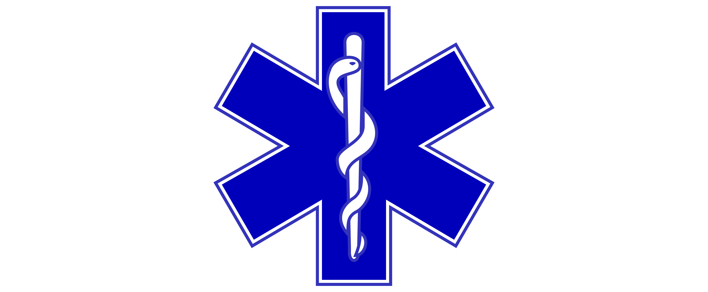
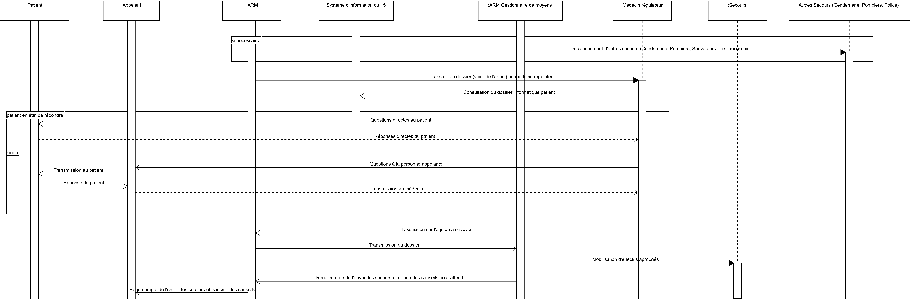

class: center, middle

# Projet Architecture
## Le système de fonctionnement du SAMU

**Maxwell Hountonhadja**, **Alban Kraus**, **Valentin Sasyan**

---

Cas d'utilisation
=================

---

Diagramme de séquence – 1ère partie
======================================

---

Diagramme de séquence – 2ème partie
======================================

---

Diagramme de séquence – 3ème partie
======================================

---

Activité : appel, premiers secours
==================================

---

Activité – Régulation
======================

---

Activité – Évacuation
======================

---

Diagramme de classes – Informations
====================================

---

Diagramme de classes – Transports
==================================

---

Déroulement du projet
=====================

* Premier choix de sujet :  les égouts de Paris. (Visite)

* Second choix de sujet : le SAMU
    - recherche documentaire
    - résumé de la documentation
    - établissement des différents diagrammes, mise au point, numérisation
    - séparation de la rédaction du rapport.

---

Conclusion
==========

* Difficultés à trouver notre sujet
* Modélisation UML par forcément adaptée
* Résultat non exhaustif
* GitHub : [https://github.com/VSasyan/Architecture](https://github.com/VSasyan/Architecture)

---

Merci de votre attention !
==========================

***Avez-vous des questions ?***
