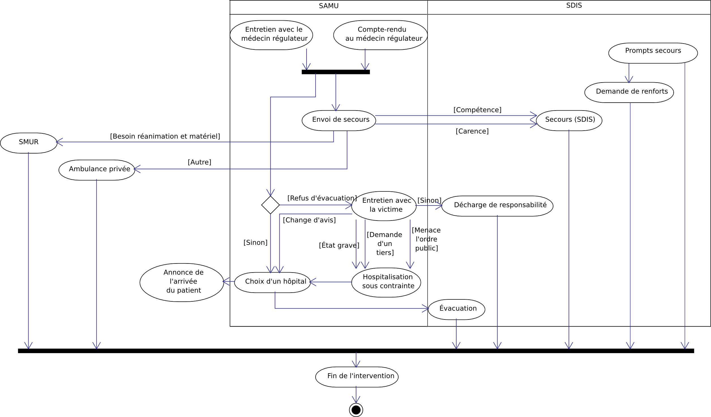

Diagramme d'activité
====================

Ce diagramme a pour but de décrire les situations rencontrées et les
choix faits par les équipes de secours dans diverses situations. Il se
base sur la description donnée par une
[convention][convention-samu-sdis] entre le SAMU et le SDIS (*les
pompiers*). Nous avons repris la plupart des informations ayant trait
à la prise en charge de l'appel et à l'intervention des secours, en
omettant les cas les plus particuliers. Dans ce diagramme, nous nous
intéresserons fort peu au matériel, aux techniques, ainsi qu'au cadre
juridique. Nous n'évoquerons pas la démarche qualité exposée dans le
document susmentionné. Ce diagramme s'éloigne un peu du sujet,
puisqu'il précise les activités du côté du SDIS (les pompiers) ; cela
est justifié par l'extrême intrication de ces deux systèmes.

Les deux cadres représentent les deux systèmes, SAMU et SDIS
(pompiers). Horizontalement, on peut lire les interactions entre les
systèmes ; de haut en bas, le déroulement des opérations.

[convention-samu-sdis]: ../data/convention_sdis_samu_231109__007576500_1759_08122010.pdf "Convention entre le SAMU et le SDIS 85"

Traitement de l'appel et premiers secours
-----------------------------------------

Selon le numéro composé, l'appelant va être orienté soit vers le
Centre de réception et de régulation des appels (CRRA) du SAMU en
ayant composé le 15, soit vers le Centre de traitement des appels
(CTA) du SDIS avec le 18 ou le 112. Ces deux centres sont
interconnectés et peuvent s'échanger les appels selon leur motif. Par
exemple, un appel signalant un dégagement de fumées toxiques sera
mieux pris en charge par les services d'incendie et de secours (SDIS),
alors qu'un appel concernant une personne qui fait un malaise
nécessite l'avis médical fournit par le SAMU.

Dans les deux cas, si la personne ayant décroché reconnaît une
certaine situation, elle peut déclencher sur-le-champ des secours,
appelés dans le diagramme « prompts secours ». Si la situation se
déroule dans un lieu public ou sur la voie publique, les pompiers sont
prévenus ainsi que les forces de l'ordre. Dans tous les cas, si la
situation requiert un avis médical, l'appel est transmis au SAMU.

Une fois sur place, ces premiers secours vont sécuriser la zone,
pratiquer les gestes de secourismes, et évaluer la situation. Ils
peuvent demander des renforts, mais dans tous les cas doivent faire un
compte-rendu au CTA et au SAMU.

Régulation médicale et envoi de secours adaptés
-----------------------------------------------

Pendant l'envoi de prompts secours, l'appel parvenu au SAMU est
transféré à un médecin régulateur, qui va s'entretenir avec
l'appelant et, si possible, la victime. Le médecin va établir son
diagnostic, conseiller la personne et peut-être déclencher des secours
plus adaptés. Le médecin s'appuie sur le compte-rendu d'une éventuelle
équipe sur place envoyée en prompt secours pour prendre sa décision.

Parmi les secours susceptibles d'être envoyés, on retiendra :

- des moyens spécialisés des sapeurs-pompiers ;
- une ambulance privée ;
- un véhicule de réanimation du SMUR ;
- un véhicule de secours et d'assistance aux victimes des pompiers ;
- un véhicule des pompiers en cas de carence.

Les moyens réquisitionnés seront adaptés à la situation et à l'état de
la victime, mais sans zèle : tous ces intervenants ont un coût
important, surtout en situation de carence.

Évacuation et fin de l'intervention
-----------------------------------

En tenant compte des souhaits de la victime, transmis lors du bilan
secouriste, le médecin trouve un hôpital capable de la recevoir, et
annonce son arrivée afin d'assurer un suivi continu de la victime.
Durant toute la durée de l'intervention, les équipes rendent compte au
SAMU et au SDIS.

Il arrive que la victime refuse d'être évacuée, et dans ce cas un
protocole strict est appliqué par les équipes sur place : décharge de
responsabilité ou évacuation sous contrainte.
