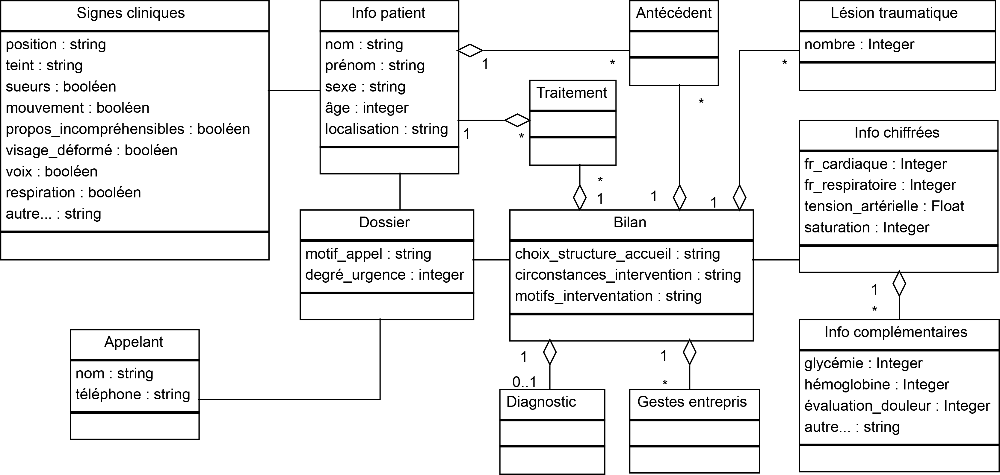

Diagramme de classes
====================

Informations
------------

Ce diagramme présente la structures du système d'information utilisé par le SAMU pour stocker les informations relatives aux interventions. Il y a deux classes principales : *Dossier* et *Bilan*.

### La classe *Dossier*

Dès la prise de l'appel, l'ARM crée un *Dossier* qui contiendra les informations nécessaires à l'intervention. L'ensemble de ces données est composé de plusieurs classes :

- la classe *Appelant*, qui contient toutes les données relatives à la personne qui passe l'appel (son numéro de téléphone et son nom) ;
- la classe *Info patient*, qui récapitule les informations principales du patient (son identité, son âge et son sexe) ;
- à cela s'ajoute la classe *Signes cliniques*, qui ajout une multitude de détails sur la situation actuelle. Les informations inscrites dans le diagramme UML ne sont pas exhaustives ;
- et aussi les classes *Antécédent* et *Traitement*, optionnelles, qui listent les antécédents connus du patient, ainsi que les traitements qu'il prend ou a pris.

### La classe *Bilan*

Lors de son intervention sur place, l'équipe de secours envoyée fait un bilan de son intervention. Certaines données vont recouper les informations contenues dans le *Dossier* initial alors que d'autres vont ajouter de l'information. Le *Bilan* est composé des classes :

- *Diagnostic*, si un diagnostic a été fait, c'est-à-dire qu'un médecin fait partie de l'équipe envoyée ;
- *Gestes entrepris*, cette classe permet de lister les gestes de premiers secours effectués par l'équipe ;
- *Lésion traumatique*, cette classe permet d'indiquer si des lésions ont été remarquées au cours de l'intervention ;
- et la classe *Info chiffrées*, qui est composée de plusieurs variables à mesurer par l'équipe. Cette classe peut aussi être complétée par des *Info complémentaires* (liste non exhaustive).
 

### Association entre ces classes

Les informations de la classe *Dossier* sont celles demandées à l'appelant ou au patient alors que celles contenues dans la classe *Bilan* sont fournies par l'équipe de secours envoyée. Ces données sont associées dans le système, d'où le lien entre les classes *Dossier* et *Bilan*.

Moyens de transport
-------------------

Ce diagramme a pour but de récapituler les différents types de transports disponibles et quelle entité les fournit.

### Transporteurs privés

Une partie des transports sont privés ; ces transports sont envoyés lors d'intervention chez un particulier ou sur un lieu privé. Cela peut être une ambulance ou un médecin (ou paramédical) privés.

### Transporteurs publics

Les transports publics dépendent des pompiers (VSAV) ou du SMUR, qui vont respectivement envoyer un camion de pompier (adapté à la situation) ou une ambulance.

### Autres cas

Dans des cas extrêmes et selon la position géographique, des moyens supplémentaires peuvent être envoyés. Par exemple, lors d'intervention en montagne (respectivement, mer) un hélicoptère de la gendarmerie (marine) pourra être utilisé. Ces cas, différents pour chaque région, ne sont pas spécifiés sur le diagramme.
