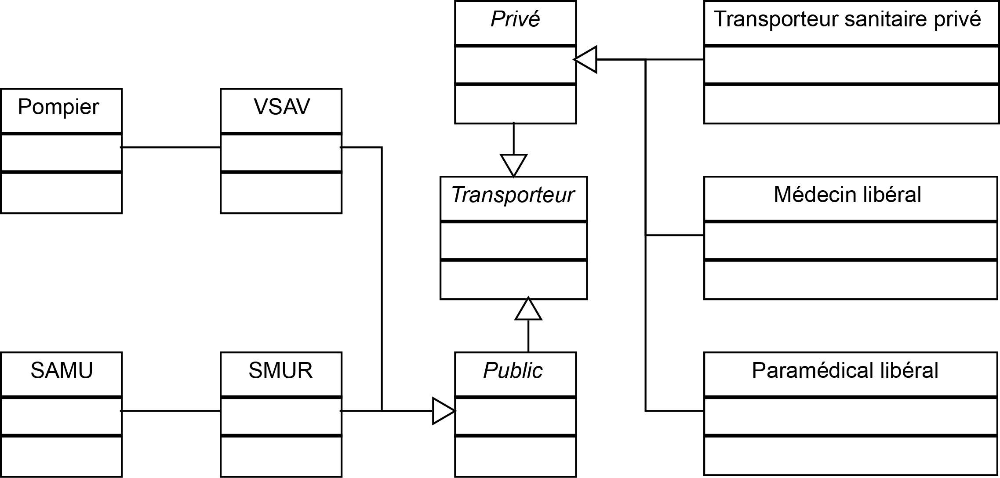

Diagramme de classes -- Moyens de transport
==========================================

Ce diagramme a pour but de récapituler les différents types de transports disponibles et quelle entité les fournit.

Transporteurs privés
--------------------

Une partie des transports sont privés ; ces transports sont envoyés lors d'intervention chez un particulier ou sur un lieu privé. Cela peut être une ambulance ou un médecin (ou paramédical) privés.

Transporteurs publics
---------------------

Les transports publics dépendent des pompiers (VSAV) ou du SMUR, qui vont respectivement envoyer un camion de pompier (adapté à la situation) ou une ambulance.

Autres cas
----------

Dans des cas extrêmes et selon la position géographique, des moyens supplémentaires peuvent être envoyés. Par exemple, lors d'intervention en montagne (respectivement, mer) un hélicoptère de la gendarmerie (marine) pourra être utilisé. Ces cas, différents pour chaque région, ne sont pas spécifiés sur le diagramme.
