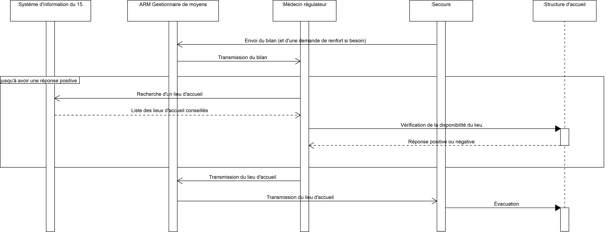

Diagramme de séquence - 3ème Partie
===================================

L'équipe de *Secours* envoie un bilan sur la situation et son intervention à l'*ARM Gestionnaire de moyens*. Si besoin, elle effectue aussi une demande de renforts. Ce bilan est retransmis au *Médecin régulateur*.

Ce Bilan contient le choix du patient (ou de sa famille) en se qui concerne le lieu d'accueil, le *Médecin régulateur* va alors tenter de trouver une place dans cet établissement ou à défault dans un plus proche/adapté. Il contact ensuite la *Structure d'accueil* concernée pour vérifier la disponibilité.

Un fois le lieu trouvé avec certitude, il est transmis à l'*ARM Gestionnaire de moyens* qui le fait suivre à l'équipe de *Secours* qui effectue alors l'évacuation.
