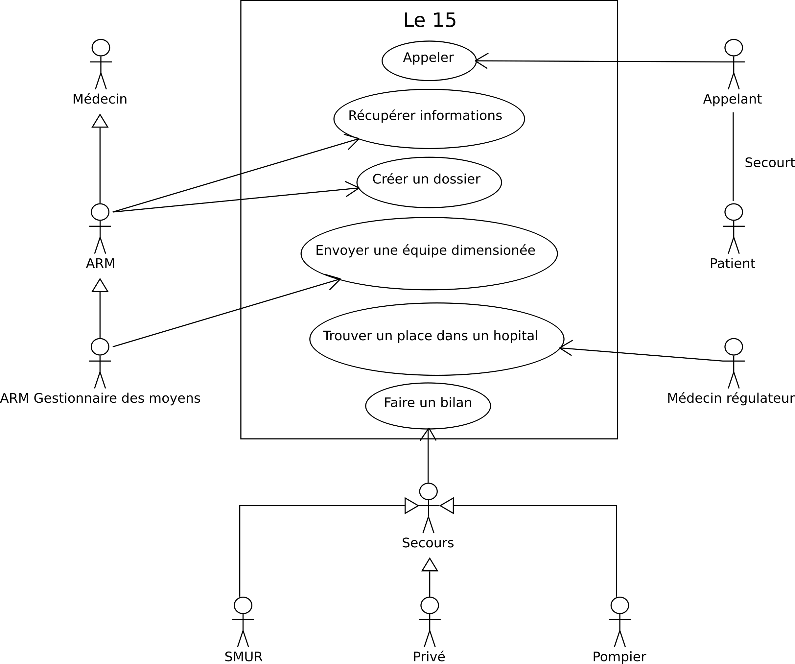

 
Diagramme de cas d'utilisation
==============================

Les acteurs du stystème
-----------------------

Les particuliers :
* le patient : c'est la personne ayant besoin d'assistance ;
* l'appelant : c'est la personne qui va contacter le SAM en composant le 15 (elle peut être aussi le patient).

Les professionnels :
* l'ARM : Assistant de régulation médicale, c'est la première personne à décrocher au téléphone, il prend les premières décisions pour savoir vers qui diriger l'appelant ;
* l'ARM gestionnaire de moyens : cet ARM n'est présent que dans les gros centres du SAMU, il est dédié à la gestion des équipes de secours envoyées ;
* le médecin régulateur : il aide l'AMR à évaluer le cas et à définir les secours à envoyer ;
* les secours : il y a différents types d'équipes à envoyer sur le terrain 
  * le SMUR : équipe spécialisée et très bien équipée pour les réanimations,
  * les pompiers : équipe déclenchée quand il y a besoin de secouristes ou qu'il y a des risques concernant la sécurité civile,
  * les privées : tous les autres cas.

Les fonctionnalités du système
------------------------------

Le système doit permettre :
* aux particuliers d'appeler le 15 ;
* à l'AMR de récupérer les informations pour traiter le cas, et de créer un dossier dans le système pour gérer le cas ;
* le médecin de régulation, avec l'ARM, décide de l'équipe adaptée à envoyer ;
* l'AMR gestionnaire des moyens envoie l'équipe ;
* les secours font sur le terrain et font un rapport.
